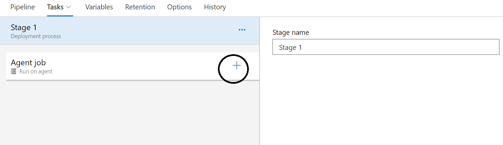

## Overview ##

In this lab, you will learn how to configure Azure ARM Template deployment using Build and Release in Azure Pipelines.

### Prerequisites ###

- This lab requires you to complete task 1 from the <a href="https://www.azuredevopslabs.com/labs/azuredevops/prereq/">prerequisite</a> instructions.

## Exercise 1: Create new repository for ARM template ##

1. Create new repository

1. Create azuredeploy.json file to the repository and copy content from [here](https://raw.githubusercontent.com/Azure/azure-quickstart-templates/master/201-aci-wordpress/azuredeploy.json) to the file

1. Commit changes

## Exercise 2: Introduction to Azure DevOps Build ##

### Task 1: Creating a basic build pipeline from a template ###

1. Navigate to your team project on Azure DevOps.

1. Navigate to **Pipelines \| Builds**.

    

1. Select **New \| New build pipeline** to create a new build pipeline.

    

1. The default option for build pipelines involves using YAML to define the process. If you are interested in that, please check out that lab. For this lab, click **use the visual designer**.

    

1. The first thing you'll need to do is to configure the source repository. Every major platform is available, but the default options are all we need here. This build will use the **master** branch of the repo you created earlier. Leave the defaults and click **Continue**.

    

1. Locate the **Empty Job** and click it. Note that there are many options that should cover all of our mainstream scenarios. For our purposes here, we'll just build the pipeline from scratch.

    

1. Click the **+** sign on **Agent Job 1** bar

    

1. search for **Azure Resource Group Deployment** and click **add**

    

1. Select **Azure Deployment: Create or Update Resource** from left side

    

1. Select Azure Subscription

    
    
1. Select Resource Group from dropdown. If you don't have an existing resource group go and create one on azure portal. Come back to this step and click the refresh sign on right.

    
    
1. Select Location (Recommended **West Europe**)

1. Choose Template location by clicking the **...*** on the right side

    
    
1. View parameters that you can override by clicking **...*** on the right side. Add MySQL Password

    

1. Accept the default options by clicking **Save & queue**.

    

### Task 2: Tracking and reviewing a build ###

1. Click the link to the newly created build.

    

1. Depending on load, the build may need to wait in the queue for a moment.

    

1. Once the build begins, you'll be able to track the console output. If you want to review an earlier task, you can click to review its logs.

    

1. The build should eventually succeed, which you can review in the **Summary** tab.

    

1. Select the **Logs** tab to see each step and how long it took.

    

