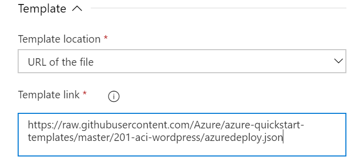

## Overview ##

In this lab, you will learn how to configure Azure ARM Template deployment using Build and Release in Azure Pipelines.

### Prerequisites ###

- This lab requires you to complete task 1 from the <a href="https://www.azuredevopslabs.com/labs/azuredevops/prereq/">prerequisite</a> instructions.

## Exercise 1: Introduction to Azure DevOps Build ##

### Task 1: Creating a basic release pipeline from a template ###

1. Navigate to your team project on Azure DevOps.

1. Navigate to **Pipelines \| Releases**.

    

1. Select **New pipeline** to create a new release pipeline.

    

1. Click  **or start with an empty job**.

    

1. It will show you an view with stage information. Ignore that and click on **1 job, 0 task** on left side

    

1. Click the **+** sign on **Agent Job** bar

    

1. search for **Azure Resource Group Deployment** and click **add**

    

1. Select **Azure Deployment: Create or Update Resource** from left side

    

1. Select Azure Subscription

    
    
1. Select Resource Group from dropdown. If you don't have an existing resource group go and create one on azure portal. Come back to this step and click the refresh sign on right.

    
    
1. Select Location (Recommended **West Europe**)

1. Select template Location  **URL of the file**
    
    

1. Copy paste following url to the link **https://raw.githubusercontent.com/Azure/azure-quickstart-templates/master/201-aci-wordpress/azuredeploy.json**

    
    
1. View parameters that you can override by clicking **...*** on the right side. Normally this would work but this time it won't since Github doesn't allow CORS requests. Click **+Add** and enter **mysqlPassword** on name and then what you want on value. Then click **OK**

    

1. Save your definition **Save**.

    
    
1. Create new release

    
    
1. Keep defaults and click **Create**

   
   
1. Open your newly created **Release-1**

   
   
1. Wait and enjoy the nice animation

   
   
1. Clean up your deployment from Azure portal

